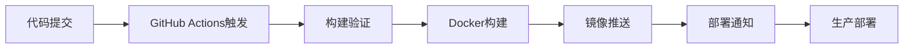

# GitHub 构建发布指南

## 🚀 快速发布

### 使用发布脚本（推荐）

#### Linux/macOS:
```bash
# 给脚本执行权限
chmod +x scripts/github-release.sh

# 执行完整发布流程
./scripts/github-release.sh
```

#### Windows:
```powershell
# 在 PowerShell 中执行
.\scripts\github-release.ps1
```

### 手动发布流程

```bash
# 1. 检查并提交修复
git add .
git commit -m "fix: 修复nginx代理配置和API路径问题"

# 2. 推送到GitHub
git push origin main

# 3. 创建版本标签（可选）
git tag -a v1.0.1 -m "Release v1.0.1 - 修复nginx代理和API路径问题"
git push origin v1.0.1
```

## 📋 GitHub Actions 工作流

### 主要工作流文件

1. **`.github/workflows/docker-build-push.yml`** - 主构建工作流
   - 触发条件：推送到 main, master, develop, midwayjs 分支
   - 功能：构建和推送Docker镜像到GitHub Container Registry

2. **`.github/workflows/test-build.yml`** - 测试构建工作流
   - 触发条件：所有分支推送
   - 功能：测试构建（不推送镜像）

3. **`.github/workflows/simple-test.yml`** - 简单测试工作流
   - 触发条件：所有推送
   - 功能：基本环境测试

### 构建触发条件

```yaml
# 自动触发
on:
  push:
    branches: [ main, master, develop, midwayjs ]
    tags: [ 'v*' ]
  pull_request:
    branches: [ main, master, midwayjs ]

# 手动触发
  workflow_dispatch:
```

### 镜像标签规则

- **`latest`** - 主分支最新版本
- **`main`**, **`develop`** - 分支名称
- **`v1.0.0`** - 版本标签
- **`main-sha123456`** - 分支+提交哈希

## 🔧 构建流程详解

### 阶段1：构建验证
1. **环境准备** - Node.js 18.x, Yarn缓存
2. **依赖安装** - 后端和前端依赖
3. **代码检查** - ESLint, 格式化
4. **构建测试** - 后端和前端构建

### 阶段2：Docker构建
1. **多阶段构建** - 后端构建 → 前端构建 → 生产镜像
2. **多平台支持** - linux/amd64, linux/arm64
3. **缓存优化** - GitHub Actions缓存
4. **镜像推送** - GitHub Container Registry

### 阶段3：发布
1. **镜像标签** - 自动生成标签
2. **元数据** - 构建信息和标签
3. **推送验证** - 确认推送成功

## 🧪 验证构建

### 1. 检查GitHub Actions状态

访问您的GitHub仓库的Actions页面：
```
https://github.com/your-username/your-repo/actions
```

### 2. 验证镜像推送

检查GitHub Container Registry：
```
https://github.com/your-username/your-repo/pkgs/container/your-repo
```

### 3. 本地测试新镜像

```bash
# 拉取最新镜像
docker pull ghcr.io/your-username/your-repo:latest

# 测试运行
docker run -d --name test-container \
  -p 8000:80 -p 8080:8080 \
  ghcr.io/your-username/your-repo:latest
```

## 🚨 故障排除

### 常见构建问题

#### 1. 权限错误
```
Error: denied: permission_denied
```

**解决方案**：
- 确保仓库的Actions权限设置正确
- 检查GITHUB_TOKEN权限

#### 2. 依赖安装失败
```
Error: yarn install failed
```

**解决方案**：
- 检查package.json文件
- 清理yarn.lock文件
- 增加网络超时时间

#### 3. 构建超时
```
Error: The operation was canceled
```

**解决方案**：
- 优化构建缓存
- 减少构建步骤
- 使用更快的构建机器

### 调试方法

#### 1. 查看构建日志
```bash
# 在GitHub Actions页面查看详细日志
# 或使用GitHub CLI
gh run list
gh run view <run-id>
```

#### 2. 本地复现构建
```bash
# 使用相同的Dockerfile本地构建
docker build -f tools/docker/Dockerfile -t test-build .
```

#### 3. 检查工作流配置
```bash
# 验证工作流语法
./scripts/utils/check-github-actions.sh
```

## 📊 监控和通知

### 构建状态徽章

在README.md中添加构建状态徽章：

```markdown

```

### 通知设置

在GitHub仓库设置中配置：
1. **Notifications** → **Actions**
2. 选择通知类型（失败、成功等）
3. 配置通知方式（邮件、Slack等）

## 🎯 最佳实践

### 1. 分支策略
- **main** - 生产环境
- **develop** - 开发环境
- **feature/** - 功能分支

### 2. 版本管理
```bash
# 语义化版本
v1.0.0  # 主版本.次版本.修订版本
v1.0.1  # 修复版本
v1.1.0  # 功能版本
v2.0.0  # 重大更新
```

### 3. 提交信息规范
```bash
# 格式：type(scope): description
fix(nginx): 修复代理配置导致的404问题
feat(auth): 添加JWT认证功能
docs(readme): 更新部署文档
```

### 4. 构建优化
- 使用多阶段构建减少镜像大小
- 启用构建缓存提高速度
- 并行构建前后端

## 🔄 持续集成流程



## 📈 性能优化

### 构建时间优化
1. **缓存策略** - 依赖缓存、构建缓存
2. **并行构建** - 前后端并行构建
3. **增量构建** - 只构建变更部分

### 镜像大小优化
1. **多阶段构建** - 分离构建和运行环境
2. **Alpine基础镜像** - 更小的基础镜像
3. **依赖清理** - 删除不必要的依赖

## 🎉 发布检查清单

- [ ] 代码已提交并推送
- [ ] GitHub Actions构建成功
- [ ] 镜像已推送到Registry
- [ ] 版本标签已创建（如适用）
- [ ] 部署文档已更新
- [ ] 生产环境准备就绪

## 📞 技术支持

如果遇到构建问题：

1. **检查构建日志** - GitHub Actions页面
2. **验证配置文件** - 工作流YAML文件
3. **本地测试** - 复现构建问题
4. **查看文档** - GitHub Actions官方文档
5. **社区支持** - GitHub Discussions或Issues
