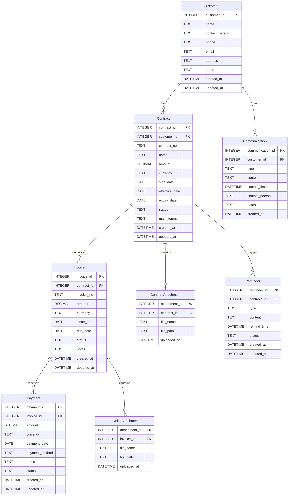

```mermaid
erDiagram
    Customer ||--o{ Contract : has
    Contract ||--o{ Invoice : generates
    Invoice ||--o{ Payment : receives
    Contract ||--o{ ContractAttachment : contains
    Invoice ||--o{ InvoiceAttachment : contains
    Customer ||--o{ Communication : has
    Contract ||--o{ Reminder : triggers

    Customer {
        INTEGER customer_id PK
        TEXT name
        TEXT contact_person
        TEXT phone
        TEXT email
        TEXT address
        TEXT notes
        DATETIME created_at
        DATETIME updated_at
    }

    Contract {
        INTEGER contract_id PK
        INTEGER customer_id FK
        TEXT contract_no
        TEXT name
        DECIMAL amount
        TEXT currency
        DATE sign_date
        DATE effective_date
        DATE expiry_date
        TEXT status
        TEXT main_terms
        DATETIME created_at
        DATETIME updated_at
    }

    Invoice {
        INTEGER invoice_id PK
        INTEGER contract_id FK
        TEXT invoice_no
        DECIMAL amount
        TEXT currency
        DATE issue_date
        DATE due_date
        TEXT status
        TEXT notes
        DATETIME created_at
        DATETIME updated_at
    }

    Payment {
        INTEGER payment_id PK
        INTEGER invoice_id FK
        DECIMAL amount
        TEXT currency
        DATE payment_date
        TEXT payment_method
        TEXT notes
        TEXT status
        DATETIME created_at
        DATETIME updated_at
    }

    ContractAttachment {
        INTEGER attachment_id PK
        INTEGER contract_id FK
        TEXT file_name
        TEXT file_path
        DATETIME uploaded_at
    }

    InvoiceAttachment {
        INTEGER attachment_id PK
        INTEGER invoice_id FK
        TEXT file_name
        TEXT file_path
        DATETIME uploaded_at
    }

    Communication {
        INTEGER communication_id PK
        INTEGER customer_id FK
        TEXT type
        TEXT content
        DATETIME contact_time
        TEXT contact_person
        TEXT notes
        DATETIME created_at
    }

    Reminder {
        INTEGER reminder_id PK
        INTEGER contract_id FK
        TEXT type
        TEXT content
        DATETIME remind_time
        TEXT status
        DATETIME created_at
        DATETIME updated_at
    }
```