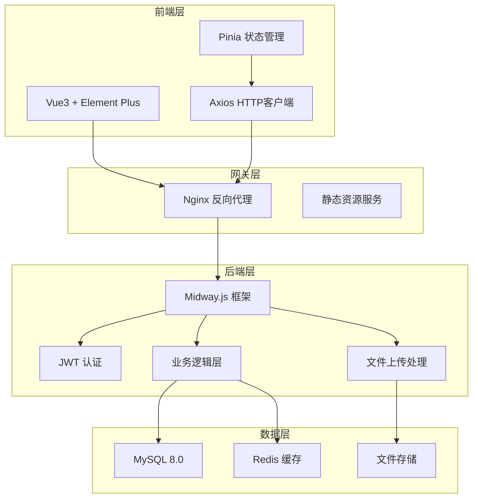
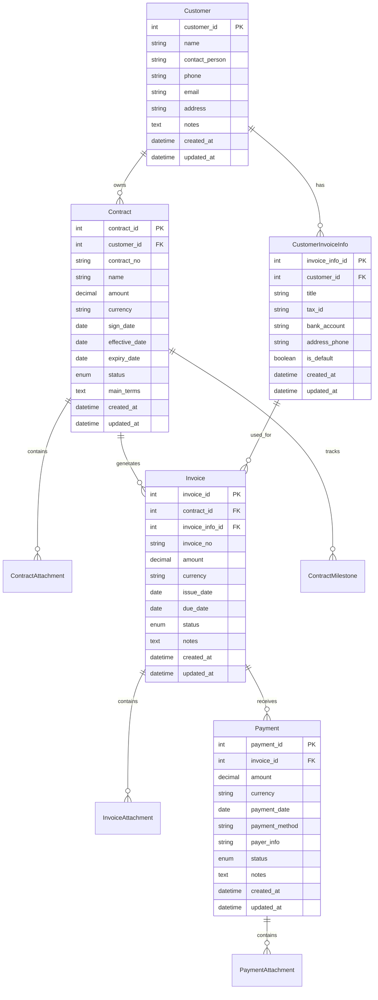
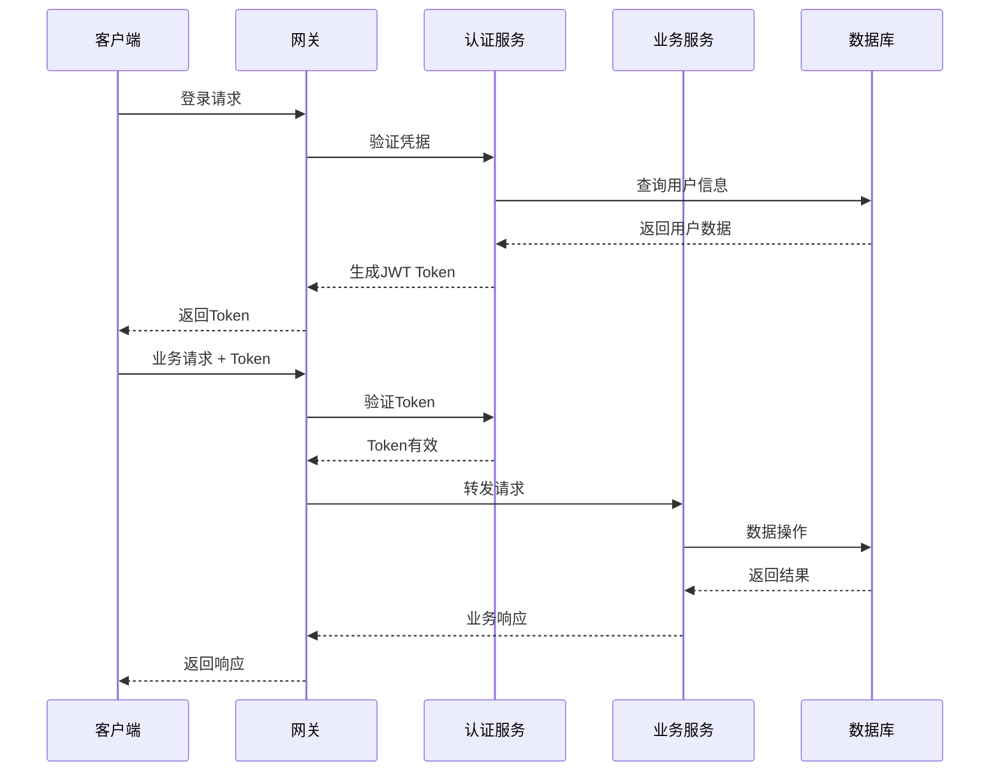
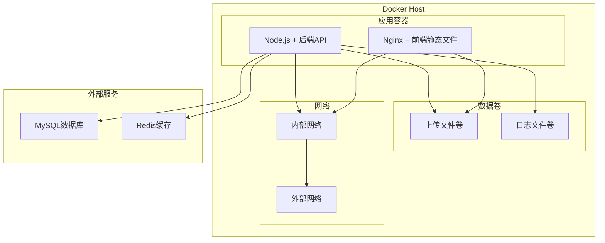

# 🏗️ 系统架构设计

## 📋 架构概览

ProjectContractLedger 采用现代化的前后端分离架构，专为中小企业合同管理场景优化设计。



## 🎯 设计原则

### 1. 单一职责
- **前端**：专注用户界面和交互体验
- **后端**：专注业务逻辑和数据处理
- **数据库**：专注数据存储和查询优化

### 2. 高内聚低耦合
- 模块化设计，功能边界清晰
- 通过标准API接口通信
- 支持独立部署和扩展

### 3. 可维护性
- 代码结构清晰，遵循最佳实践
- 完整的文档和注释
- 标准化的开发流程

## 🔧 技术栈详解

### 前端技术栈
```yaml
框架: Vue.js 3.x
  - 组合式API
  - TypeScript支持
  - 响应式系统

构建工具: Vite
  - 快速热重载
  - 模块化构建
  - 优化的生产构建

UI组件库: Element Plus
  - 丰富的组件生态
  - 企业级设计语言
  - 完善的主题定制

状态管理: Pinia
  - 轻量级状态管理
  - TypeScript友好
  - 开发工具支持

HTTP客户端: Axios
  - 请求/响应拦截
  - 错误处理
  - 请求取消
```

### 后端技术栈
```yaml
框架: Midway.js 3.x
  - 企业级Node.js框架
  - 依赖注入
  - 装饰器支持
  - TypeScript原生支持

ORM: TypeORM
  - 类型安全的数据库操作
  - 迁移管理
  - 关系映射

认证: JWT
  - 无状态认证
  - 跨域支持
  - 安全性保障

文档: Swagger/OpenAPI
  - 自动生成API文档
  - 接口测试
  - 类型定义
```

### 数据存储
```yaml
主数据库: MySQL 8.0
  - ACID事务支持
  - 丰富的索引类型
  - 高性能查询

缓存: Redis 6.0
  - 会话存储
  - 数据缓存
  - 分布式锁

文件存储: 本地文件系统
  - 合同附件存储
  - 发票文件存储
  - 支付凭证存储
```

## 📊 数据模型设计

### 核心实体关系


### 状态管理设计
```yaml
合同状态流转:
  - 草稿 → 待签署 → 履行中 → 已完成
  - 支持作废和终止状态

发票状态流转:
  - 待开票 → 已开票 → 已邮寄 → 已签收
  - 支持作废状态

付款状态流转:
  - 待确认 → 已确认 → 已核销
  - 支持部分核销状态
```

## 🔐 安全架构

### 认证授权


### 数据安全
- **传输加密**：HTTPS/TLS 1.3
- **存储加密**：敏感数据字段加密
- **访问控制**：基于角色的权限控制
- **审计日志**：关键操作记录

## 🚀 部署架构

### 开发环境
```yaml
前端开发服务器: Vite Dev Server (端口8000)
后端开发服务器: Midway Dev Server (端口8080)
数据库: 本地MySQL实例
缓存: 本地Redis实例
```

### 生产环境
```yaml
容器化部署: Docker + Docker Compose
反向代理: Nginx
应用服务: Node.js容器
数据库: 外部MySQL服务
缓存: 外部Redis服务
文件存储: 挂载卷
```

### 容器架构


## 📈 性能优化

### 前端优化
- **代码分割**：路由级别的懒加载
- **资源压缩**：Gzip/Brotli压缩
- **缓存策略**：静态资源长期缓存
- **CDN加速**：静态资源CDN分发

### 后端优化
- **数据库优化**：索引优化、查询优化
- **缓存策略**：Redis缓存热点数据
- **连接池**：数据库连接池管理
- **异步处理**：文件上传异步处理

### 数据库优化
```sql
-- 关键索引设计
CREATE INDEX idx_customer_name ON customers(name);
CREATE INDEX idx_contract_customer ON contracts(customer_id);
CREATE INDEX idx_contract_status ON contracts(status);
CREATE INDEX idx_invoice_contract ON invoices(contract_id);
CREATE INDEX idx_payment_invoice ON payments(invoice_id);
CREATE INDEX idx_created_at ON contracts(created_at);
```

## 🔄 扩展性设计

### 水平扩展
- **无状态设计**：应用服务无状态，支持多实例
- **负载均衡**：Nginx负载均衡
- **数据库分片**：支持读写分离

### 功能扩展
- **插件架构**：支持功能模块插件化
- **API版本管理**：向后兼容的API版本策略
- **微服务演进**：支持向微服务架构演进

## 🛠️ 开发工具链

### 代码质量
- **ESLint**：代码规范检查
- **Prettier**：代码格式化
- **TypeScript**：类型安全
- **单元测试**：Jest测试框架

### 构建部署
- **GitHub Actions**：CI/CD流水线
- **Docker**：容器化部署
- **版本管理**：语义化版本控制

## 📊 监控运维

### 应用监控
- **健康检查**：应用健康状态监控
- **性能监控**：响应时间、吞吐量监控
- **错误监控**：异常和错误日志收集

### 基础设施监控
- **资源监控**：CPU、内存、磁盘使用率
- **网络监控**：网络连接和带宽使用
- **数据库监控**：数据库性能和连接状态

这个架构设计确保了系统的可靠性、可扩展性和可维护性，为企业级合同管理提供了坚实的技术基础。