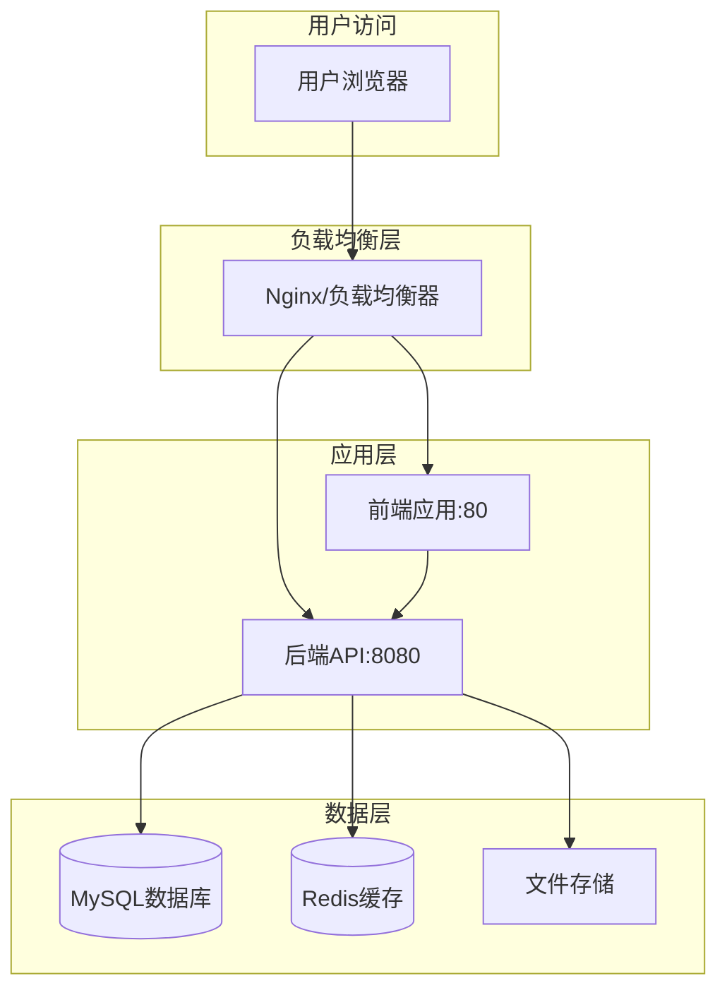

# 🚀 部署指南

本指南整合了所有部署相关的内容，提供完整的部署解决方案。

## 📋 部署方式对比

| 部署方式 | 复杂度 | 维护成本 | 扩展性 | 适用场景 |
|---------|--------|----------|--------|----------|
| Docker一键部署 | ⭐ | ⭐ | ⭐⭐ | 开发、测试、小型生产 |
| GitHub Actions | ⭐⭐ | ⭐⭐ | ⭐⭐⭐ | 团队协作、生产环境 |
| 分离式部署 | ⭐⭐⭐ | ⭐⭐⭐ | ⭐⭐⭐⭐ | 大型生产、高可用 |
| 手动部署 | ⭐⭐ | ⭐⭐⭐⭐ | ⭐ | 学习、调试 |

## 🐳 Docker 一键部署 (推荐)

### 开发环境部署
```bash
# 1. 克隆项目
git clone https://github.com/bluewatercg/projectcontractledger.git
cd projectcontractledger

# 2. 启动开发环境
cd tools/docker
./start-dev.sh
```

### 生产环境部署
```bash
# 1. 进入 Docker 目录
cd tools/docker

# 2. 配置环境变量
cp .env.example .env
# 编辑 .env 文件，设置数据库密码、JWT密钥等

# 3. 启动生产环境
./start-prod.sh
```

**访问地址**: 
- 开发环境: http://localhost
- 生产环境: http://your-server-ip

**数据持久化**:
- 附件存储: `./data/uploads` → `/app/uploads`
- 应用日志: `./data/logs` → `/app/logs`
- 数据库数据: Docker 卷自动管理

## 🚀 GitHub Actions 自动部署

### 快速部署
```bash
# 1. 下载部署脚本
wget https://raw.githubusercontent.com/bluewatercg/projectcontractledger/main/deploy-simple.sh
chmod +x deploy-simple.sh

# 2. 初始化部署环境
./deploy-simple.sh --init

# 3. 配置数据库信息（编辑 .env.external-simple 文件）
# 填写MySQL和Redis连接信息

# 4. 启动服务
./deploy-simple.sh
```

### 环境变量配置
```env
# 数据库配置
DB_HOST=your-mysql-host
DB_PORT=3306
DB_USERNAME=your-username
DB_PASSWORD=your-password
DB_DATABASE=procontractledger

# Redis配置
REDIS_HOST=your-redis-host
REDIS_PORT=6379
REDIS_PASSWORD=your-redis-password

# JWT配置
JWT_SECRET=your-super-secret-key
JWT_EXPIRES_IN=7d

# 应用配置
NODE_ENV=production
PORT=8080
```

## 🏗️ 分离式部署

### 前后端分离部署
```bash
# 1. 下载分离部署配置
git clone https://github.com/bluewatercg/projectcontractledger.git
cd projectcontractledger/deployment

# 2. 配置环境变量
cp .env.separated.template .env.separated
# 编辑 .env.separated 文件，填写数据库和服务器IP配置

# 3. 启动分离服务
# Linux/macOS
./deploy-separated.sh

# Windows
.\deploy-separated.ps1
```

**访问地址**:
- 前端: http://your-server-ip:80
- 后端API: http://your-server-ip:8080
- 统一入口: http://your-server-ip:8000

### 架构图


## 🔧 环境要求

### 基础要求
- **Docker** >= 20.0
- **Docker Compose** >= 2.0
- **Git** (用于代码拉取)

### 外部服务
- **MySQL** >= 8.0 (推荐)
- **Redis** >= 6.0 (推荐)

### 系统资源
- **CPU**: 2核心以上
- **内存**: 4GB以上
- **磁盘**: 20GB以上可用空间

## 📋 部署检查清单

### 部署前检查
- [ ] 服务器环境满足要求
- [ ] Docker和Docker Compose已安装
- [ ] 外部MySQL和Redis服务可用
- [ ] 防火墙端口已开放
- [ ] 域名DNS已配置（如需要）

### 配置检查
- [ ] 环境变量文件已正确配置
- [ ] 数据库连接信息正确
- [ ] JWT密钥已设置（至少32字符）
- [ ] 文件上传目录权限正确
- [ ] SSL证书已配置（生产环境）

### 部署后验证
- [ ] 前端页面可以正常访问
- [ ] 后端API响应正常
- [ ] 数据库连接成功
- [ ] Redis缓存工作正常
- [ ] 文件上传功能正常
- [ ] 用户登录功能正常

## 🚨 安全配置

### 必需的安全措施
```bash
# 1. 修改默认密码
# 编辑环境变量文件，设置强密码

# 2. 配置防火墙
ufw allow 80
ufw allow 443
ufw allow 22
ufw enable

# 3. 设置SSL证书（生产环境）
# 使用Let's Encrypt或其他证书

# 4. 配置备份策略
# 设置自动备份脚本
```

### 安全检查清单
- [ ] 所有默认密码已修改
- [ ] 防火墙已正确配置
- [ ] SSL证书已安装（生产环境）
- [ ] 数据库访问已限制
- [ ] 日志监控已启用
- [ ] 备份策略已设置

## 📊 监控与维护

### 系统监控
```bash
# Docker 环境管理
cd tools/docker
./monitor.sh

# 查看容器状态
docker-compose ps

# 查看资源使用
docker stats

# 查看日志
docker-compose logs -f app
```

### 日志管理
```bash
# Docker 环境日志
tail -f tools/docker/data/logs/app.log
tail -f tools/docker/data/logs/error.log

# 容器日志
docker-compose logs -f app
docker-compose logs -f mysql

# 传统部署日志
tail -f apps/backend/logs/midway-core.log
```

### 备份策略
```bash
# 数据备份
cd tools/docker
./backup.sh

# 自动备份设置
crontab -e
# 添加：0 2 * * * /path/to/backup.sh
```

## 🔄 更新部署

### 自动更新
```bash
# 拉取最新镜像
./deploy-simple.sh --pull

# 重启服务
./deploy-simple.sh --restart
```

### 手动更新
```bash
# 更新代码
git pull origin main

# 重新构建
docker-compose build

# 重启服务
docker-compose restart
```

## 🆘 故障排除

### 常见问题

#### 1. 容器启动失败
```bash
# 查看容器日志
docker-compose logs app

# 检查配置文件
docker-compose config

# 重新构建镜像
docker-compose build --no-cache
```

#### 2. 数据库连接失败
```bash
# 测试数据库连接
mysql -h DB_HOST -u DB_USERNAME -p

# 检查网络连接
docker-compose exec app ping mysql-host

# 查看数据库日志
docker-compose logs mysql
```

#### 3. 文件上传失败
```bash
# 检查目录权限
ls -la data/uploads/

# 修复权限
chmod 755 data/uploads/
chown -R 1000:1000 data/uploads/
```

#### 4. 前端页面无法访问
```bash
# 检查Nginx配置
docker-compose exec nginx nginx -t

# 重启Nginx
docker-compose restart nginx

# 查看Nginx日志
docker-compose logs nginx
```

### 性能优化

#### 数据库优化
```sql
-- 查看慢查询
SHOW VARIABLES LIKE 'slow_query_log';
SHOW VARIABLES LIKE 'long_query_time';

-- 优化索引
ANALYZE TABLE contracts;
OPTIMIZE TABLE contracts;
```

#### 缓存优化
```bash
# Redis 内存使用
redis-cli info memory

# 清理缓存
redis-cli flushdb
```

#### 应用优化
```bash
# 查看应用性能
docker stats contract-ledger-app

# 调整资源限制
# 编辑 docker-compose.yml 中的 resources 配置
```

## 📞 获取帮助

### 遇到问题时
1. 📖 查看本故障排除部分
2. 🔍 检查 [GitHub Issues](https://github.com/bluewatercg/projectcontractledger/issues)
3. 💬 参与 [社区讨论](https://github.com/bluewatercg/projectcontractledger/discussions)

### 技术支持
- 📧 **邮件支持**: 发送详细的错误日志和环境信息
- 🐛 **Bug报告**: 使用Issue模板提交问题
- 💡 **功能建议**: 通过Discussions提出改进建议

---

选择适合您需求的部署方案，开始您的 ProjectContractLedger 之旅！🎉