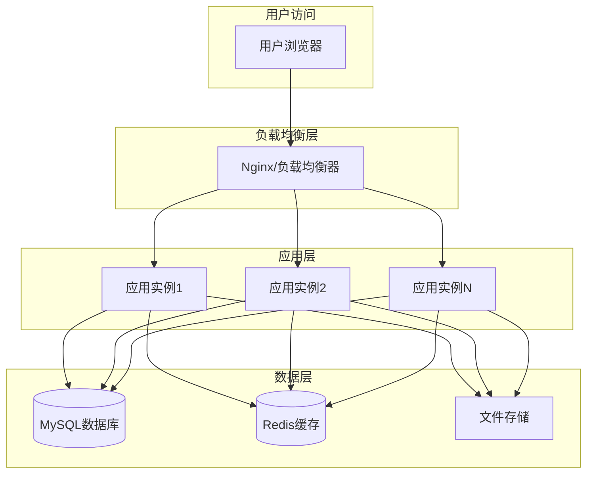

# 🚀 部署文档中心

本目录包含 ProjectContractLedger 的所有部署相关文档，按部署方式和环境分类组织。

## 📁 文档结构

```
docs/deployment/
├── README.md                           # 部署文档索引 (本文件)
├── production-deployment.md            # 生产环境部署指南
├── docker-deployment.md               # Docker部署完整指南
├── github-actions-deployment.md       # CI/CD自动部署
├── separated-deployment.md            # 分离式部署方案
├── deployment-checklist.md            # 部署检查清单
└── troubleshooting.md                 # 部署故障排除
```

## 🎯 快速导航

### 🌟 推荐部署方案

#### 1. 🐳 Docker 一键部署 (推荐)
- **文档**: [Docker部署指南](docker-deployment.md)
- **适用场景**: 开发环境、测试环境、小型生产环境
- **特点**: 简单快速、环境一致、易于维护

#### 2. 🚀 GitHub Actions 自动部署
- **文档**: [CI/CD自动部署](github-actions-deployment.md)
- **适用场景**: 生产环境、团队协作
- **特点**: 自动化、版本控制、质量保证

#### 3. 🏗️ 分离式部署
- **文档**: [分离式部署方案](separated-deployment.md)
- **适用场景**: 大型生产环境、高可用需求
- **特点**: 灵活配置、独立扩展、高性能

### 📋 部署流程

#### 新手用户
1. 📖 阅读 [生产环境部署指南](production-deployment.md)
2. 🐳 选择 [Docker部署方案](docker-deployment.md)
3. ✅ 使用 [部署检查清单](deployment-checklist.md)

#### 运维人员
1. 🏗️ 了解 [分离式部署方案](separated-deployment.md)
2. 🚀 配置 [CI/CD自动部署](github-actions-deployment.md)
3. 🔧 参考 [部署故障排除](troubleshooting.md)

#### 开发团队
1. 🚀 设置 [GitHub Actions](github-actions-deployment.md)
2. 🐳 使用 [Docker开发环境](docker-deployment.md#开发环境)
3. ✅ 遵循 [部署检查清单](deployment-checklist.md)

## 🛠️ 部署方式对比

| 部署方式 | 复杂度 | 维护成本 | 扩展性 | 适用场景 |
|---------|--------|----------|--------|----------|
| Docker一键部署 | ⭐ | ⭐ | ⭐⭐ | 开发、测试、小型生产 |
| GitHub Actions | ⭐⭐ | ⭐⭐ | ⭐⭐⭐ | 团队协作、生产环境 |
| 分离式部署 | ⭐⭐⭐ | ⭐⭐⭐ | ⭐⭐⭐⭐ | 大型生产、高可用 |
| 手动部署 | ⭐⭐ | ⭐⭐⭐⭐ | ⭐ | 学习、调试 |

## 🔧 环境要求

### 基础要求
- **Docker** >= 20.0
- **Docker Compose** >= 2.0
- **Git** (用于代码拉取)

### 外部服务
- **MySQL** >= 8.0 (推荐)
- **Redis** >= 6.0 (推荐)

### 系统资源
- **CPU**: 2核心以上
- **内存**: 4GB以上
- **磁盘**: 20GB以上可用空间

## 📊 部署架构图



## 🚨 重要提醒

### 安全注意事项
- 🔐 **修改默认密码**: 部署前必须修改所有默认密码
- 🛡️ **配置防火墙**: 只开放必要的端口
- 🔒 **HTTPS配置**: 生产环境必须使用HTTPS
- 📝 **定期备份**: 设置自动备份策略

### 性能优化
- 📊 **监控配置**: 设置系统监控和告警
- 🚀 **缓存策略**: 合理配置Redis缓存
- 📈 **资源限制**: 设置合适的资源限制
- 🔄 **负载均衡**: 多实例部署时配置负载均衡

## 📞 获取帮助

### 遇到问题时
1. 📖 查看 [部署故障排除](troubleshooting.md)
2. 🔍 检查 [GitHub Issues](https://github.com/bluewatercg/projectcontractledger/issues)
3. 💬 参与 [社区讨论](https://github.com/bluewatercg/projectcontractledger/discussions)

### 技术支持
- 📧 **邮件支持**: 发送详细的错误日志和环境信息
- 🐛 **Bug报告**: 使用Issue模板提交问题
- 💡 **功能建议**: 通过Discussions提出改进建议

---

选择适合您需求的部署方案，开始您的 ProjectContractLedger 之旅！🎉