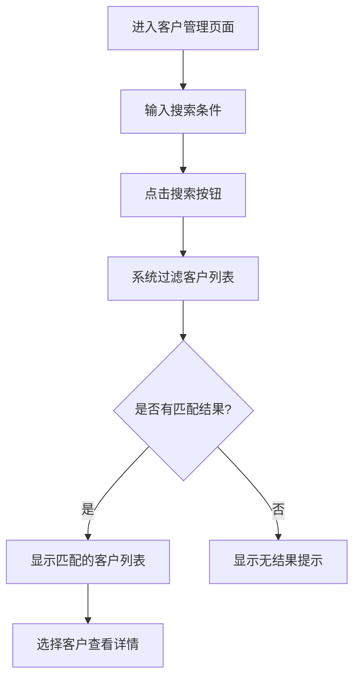
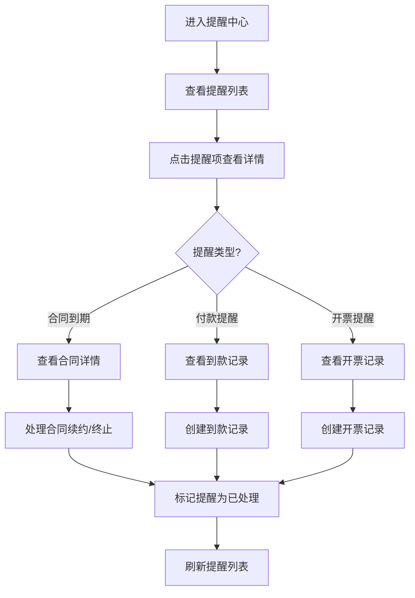
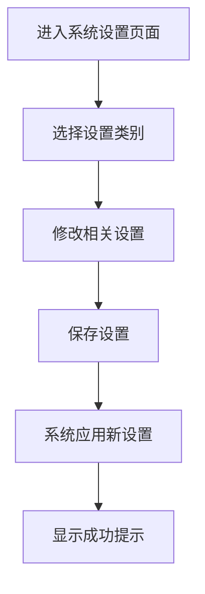
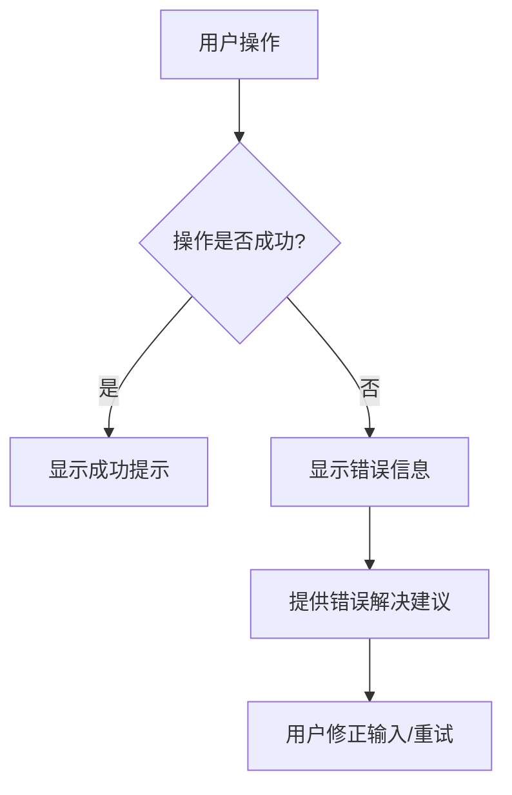

# 客户合同管理系统 - 用户操作流程图

## 1. 概述

本文档提供客户合同管理系统的主要用户操作流程图，旨在可视化系统的核心业务流程和用户交互路径，为开发和测试提供参考。

## 2. 系统主流程

```mermaid
flowchart TD
    A[登录系统] --> B[仪表盘/首页]
    B --> C1[客户管理]
    B --> C2[合同管理]
    B --> C3[开票管理]
    B --> C4[到款管理]
    B --> C5[提醒中心]
    
    C1 --> D1[查看客户列表]
    C1 --> D2[创建新客户]
    C1 --> D3[查看客户详情]
    D3 --> D4[管理客户开票信息 (customer-invoice-info.html)]
    
    C2 --> E1[查看合同列表]
    C2 --> E2[创建新合同]
    C2 --> E3[查看合同详情]
    
    C3 --> F1[查看开票列表]
    C3 --> F2[创建开票记录]
    
    C4 --> G1[查看到款列表]
    C4 --> G2[创建到款记录]
    
    C5 --> H1[查看提醒列表]
    C5 --> H2[处理提醒事项]
```

## 3. 客户管理流程

### 3.1 创建客户流程

```mermaid
flowchart TD
    A[进入客户管理页面] --> B[点击"新建客户"按钮]
    B --> C[填写客户基本信息]
    C --> D{信息是否完整?}
    D -->|是| E[保存客户信息]
    D -->|否| F[显示错误提示]
    F --> C
    E --> G[客户创建成功]
    G --> H[返回客户列表/查看客户详情]
```

### 3.2 客户查询流程



## 4. 合同管理流程

### 4.1 创建合同流程

```mermaid
flowchart TD
    A[进入合同管理页面] --> B[点击"新建合同"按钮]
    B --> C[选择关联客户]
    C --> D[填写合同基本信息]
    D --> E[上传合同附件]
    E --> F{信息是否完整?}
    F -->|是| G[保存合同信息]
    F -->|否| H[显示错误提示]
    H --> D
    G --> I[合同创建成功]
    I --> J[返回合同列表/查看合同详情]
```

### 4.2 合同状态更新流程

```mermaid
flowchart TD
    A[进入合同详情页面] --> B[点击"更新状态"按钮]
    B --> C[选择新状态]
    C --> D[填写状态变更原因/备注]
    D --> E[确认更新]
    E --> F[系统更新合同状态]
    F --> G[显示成功提示]
    G --> H[刷新合同详情页]
```

## 5. 开票管理流程

### 5.1 创建开票记录流程

```mermaid
flowchart TD
    A[进入开票管理页面] --> B[点击"新建开票记录"按钮]
    B --> C[选择关联合同]
    C --> C_INFO[选择/管理客户开票信息 (来自 customer-invoice-info.html)]
    C_INFO --> D[填写开票信息]
    D --> E{信息是否完整?}
    E -->|是| F[保存开票记录]
    E -->|否| G[显示错误提示]
    G --> D
    F --> H[开票记录创建成功]
    H --> I[返回开票列表]
```

## 6. 到款管理流程

### 6.1 创建到款记录流程

```mermaid
flowchart TD
    A[进入到款管理页面] --> B[点击"新建到款记录"按钮]
    B --> C[选择关联合同/开票]
    C --> D[填写到款信息]
    D --> E{信息是否完整?}
    E -->|是| F[保存到款记录]
    E -->|否| G[显示错误提示]
    G --> D
    F --> H[到款记录创建成功]
    H --> I[返回到款列表]
```

### 6.2 到款核销流程

```mermaid
flowchart TD
    A[进入到款详情页面] --> B[点击"核销"按钮]
    B --> C[选择关联的开票记录]
    C --> D[确认核销金额]
    D --> E[提交核销信息]
    E --> F[系统更新到款和开票状态]
    F --> G[显示成功提示]
    G --> H[刷新到款详情页]
```

## 7. 提醒处理流程



## 8. 数据导出流程

```mermaid
flowchart TD
    A[进入数据列表页面] --> B[设置筛选条件]
    B --> C[点击"导出"按钮]
    C --> D[选择导出格式]
    D --> E[确认导出]
    E --> F[系统生成导出文件]
    F --> G[下载文件到本地]
```

## 9. 系统设置流程



## 10. 错误处理流程



## 11. 注意事项

1. 以上流程图基于产品需求文档(PRD)和用户故事地图设计，展示了系统的主要操作路径。
2. 实际开发中可能需要根据具体实现调整部分流程细节。
3. 流程图使用Mermaid语法编写，可在支持Mermaid的Markdown查看器中正确渲染。
4. MVP版本可能不包含所有流程，应优先实现核心业务流程。