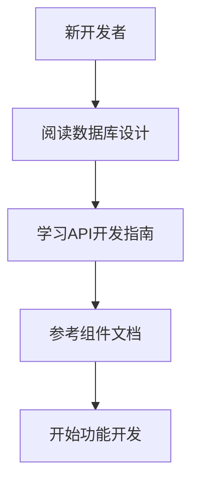
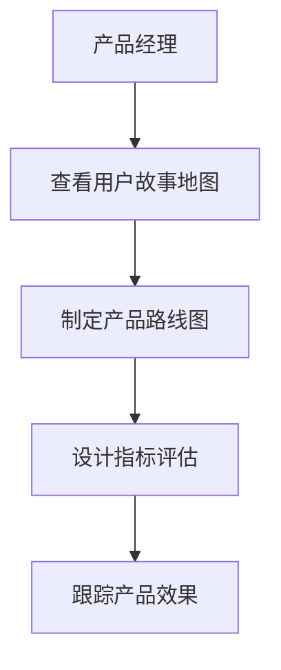
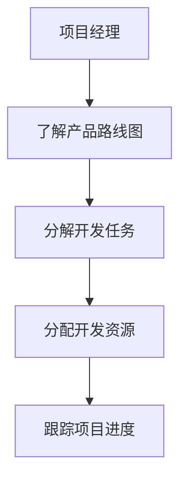

# 🛠️ 开发文档中心

欢迎来到 ProjectContractLedger 的开发文档中心！这里包含了所有开发相关的技术文档和指南。

## 📁 文档分类

### 🏗️ 核心开发文档

#### 🌟 必读文档
| 文档名称 | 描述 | 适用对象 |
|---------|------|----------|
| **[API开发指南](./API_Development_Guide.md)** | 后端API开发的完整指南 | 后端开发者 |
| **[数据库设计](./Database_Design.md)** | 完整的数据库设计文档 | 全栈开发者 |

#### 🧩 组件文档
| 文档名称 | 描述 | 适用对象 |
|---------|------|----------|
| **[客户选择组件](./Customer_Select_Component.md)** | 智能客户选择组件使用指南 | 前端开发者 |

### 📋 产品规划文档

#### 📊 产品策略
| 文档名称 | 描述 | 适用对象 |
|---------|------|----------|
| **[用户故事地图](./User_Story_Map.md)** | 完整的用户故事和产品规划 | 产品经理、开发者 |
| **[产品路线图](./Roadmap.md)** | 产品发展规划和版本迭代 | 产品经理、项目经理 |
| **[指标评估框架](./Metrics_Framework.md)** | 产品评估和数据分析指标 | 产品经理、数据分析师 |

## 🚀 快速导航

### 🆕 新开发者入门
1. **[数据库设计](./Database_Design.md)** - 了解数据模型和表结构
2. **[API开发指南](./API_Development_Guide.md)** - 学习后端API开发规范
3. **[用户故事地图](./User_Story_Map.md)** - 理解产品需求和功能规划

### 🔧 功能开发
1. **查看组件文档** - [客户选择组件](./Customer_Select_Component.md)
2. **参考API指南** - [API开发指南](./API_Development_Guide.md)
3. **检查数据结构** - [数据库设计](./Database_Design.md)

### 📈 产品规划
1. **[用户故事地图](./User_Story_Map.md)** - 用户需求分析
2. **[产品路线图](./Roadmap.md)** - 版本规划和优先级
3. **[指标评估框架](./Metrics_Framework.md)** - 产品效果评估

## 📚 文档详情

### 🏗️ [API开发指南](./API_Development_Guide.md)
**内容概览**: Midway.js框架开发指南，包含API设计规范、数据库操作、认证授权等
- 🎯 **适用场景**: 后端API开发、接口设计
- 📄 **文档大小**: 25.1KB
- 🔄 **更新状态**: 活跃维护

### 🗄️ [数据库设计](./Database_Design.md)
**内容概览**: 完整的数据库设计文档，包含表结构、索引策略、查询优化等
- 🎯 **适用场景**: 数据库开发、架构设计
- 📄 **文档大小**: 18.2KB
- 🔄 **更新状态**: 活跃维护

### 🎯 [客户选择组件](./Customer_Select_Component.md)
**内容概览**: 智能客户选择组件的使用指南，包含API、性能优化等
- 🎯 **适用场景**: 前端组件开发、性能优化
- 📄 **文档大小**: 5.8KB
- 🔄 **更新状态**: 功能文档

### 📋 [用户故事地图](./User_Story_Map.md)
**内容概览**: 完整的用户故事和产品功能规划，按版本迭代组织
- 🎯 **适用场景**: 产品规划、需求分析
- 📄 **文档大小**: 12.0KB
- 🔄 **更新状态**: 产品规划

### 🛣️ [产品路线图](./Roadmap.md)
**内容概览**: 产品发展方向和版本规划，技术发展计划
- 🎯 **适用场景**: 项目管理、版本规划
- 📄 **文档大小**: 7.9KB
- 🔄 **更新状态**: 产品规划

### 📊 [指标评估框架](./Metrics_Framework.md)
**内容概览**: 产品数据指标和评估体系，包含AARRR模型和HEART框架
- 🎯 **适用场景**: 产品分析、数据监控
- 📄 **文档大小**: 7.8KB
- 🔄 **更新状态**: 产品规划

## 🎯 使用指南

### 👨‍💻 对于开发者

### 👥 对于产品经理

### 🔧 对于项目经理

## 📝 文档维护

### 🔄 更新频率
- **API开发指南**: 代码变更时同步更新
- **数据库设计**: 数据模型变更时更新
- **组件文档**: 组件功能变更时更新
- **产品文档**: 产品规划调整时更新

### ✅ 质量标准
- 内容准确性和实用性
- 代码示例可运行
- 文档结构清晰
- 及时反映最新状态

### 🤝 贡献指南
1. 新功能开发需要补充相应文档
2. API变更必须同步更新文档
3. 重要变更需要更新多个相关文档
4. 定期检查和更新过时内容

## 🔗 相关链接

- [📚 文档中心](../README.md) - 所有文档导航
- [🚀 快速开始](../QUICK_START.md) - 新手入门指南
- [🏗️ 系统架构](../ARCHITECTURE.md) - 整体架构设计
- [🔧 故障排除](../TROUBLESHOOTING.md) - 常见问题解决

---

**🛠️ 开发愉快！如有问题请参考相关文档或提交Issue。**