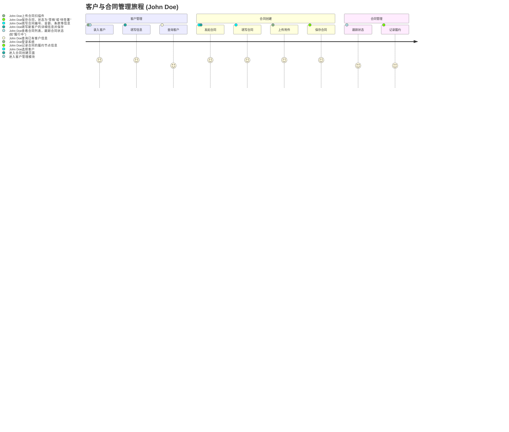
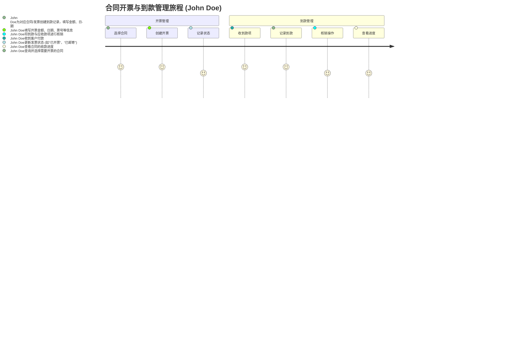
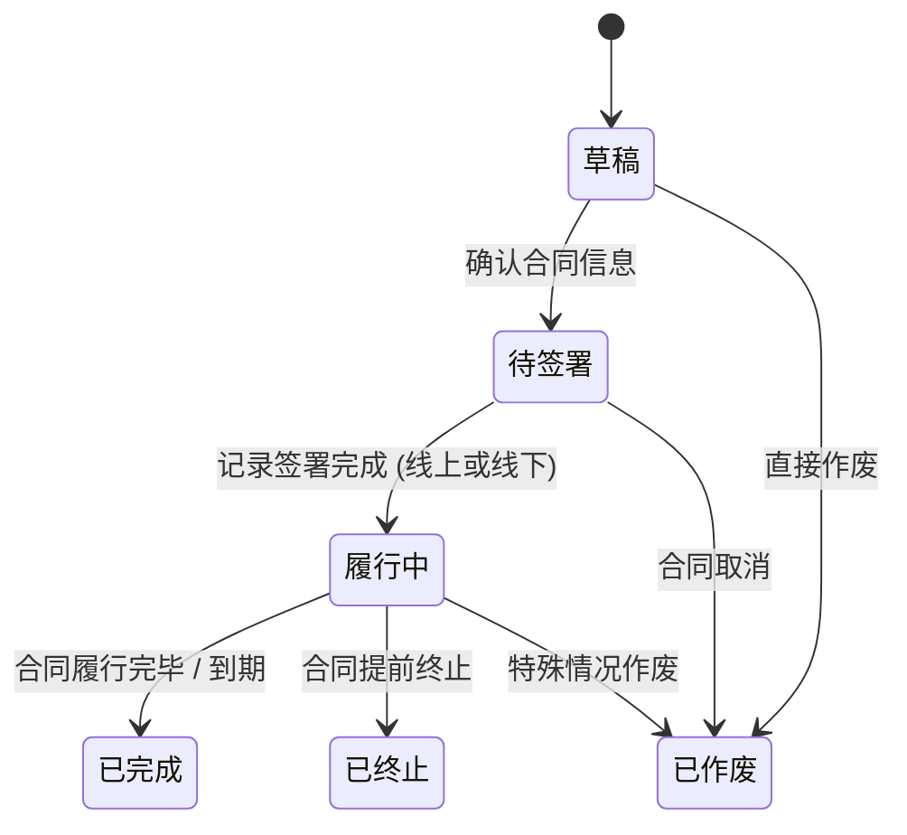
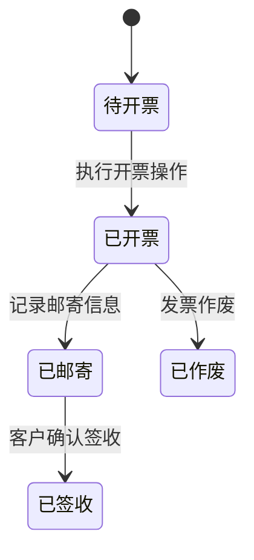
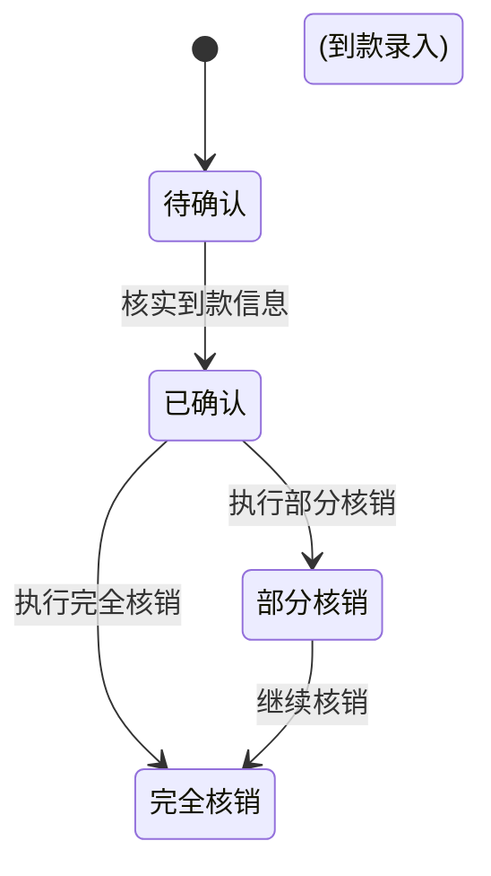

# 产品需求文档 (PRD) - 客户合同管理系统

## 1. 文档信息

### 1.1 版本历史

| 版本号 | 日期       | 作者 | 变更说明 |
| ------ | ---------- | ---- | -------- |
| V1.0   | YYYY-MM-DD | Trae AI | 初始草稿 |

### 1.2 文档目的

本文档旨在明确客户合同管理系统的产品需求，作为产品设计、开发、测试和运营的依据。

### 1.3 相关文档引用

- [产品路线图 (Roadmap)](./Roadmap.md)
- [用户故事地图 (User Story Map)](./User_Story_Map.md)
- [产品评估指标框架 (Metrics Framework)](./Metrics_Framework.md)

## 2. 产品概述

### 2.1 产品名称与定位

- **产品名称**: 客户合同管理系统 (单用户版)
- **产品定位**: 一款帮助单个用户高效管理客户合同全生命周期，包括客户、合同、开票和到款的工具，旨在简化管理流程、清晰记录、便捷追踪。

### 2.2 产品愿景与使命

- **产品愿景**: 成为中小企业首选的智能化合同管理平台。
- **产品使命**: 通过技术创新，简化合同管理流程，赋能企业专注于核心业务增长。

### 2.3 价值主张与独特卖点 (USP)

- **价值主张**:
    - 高效管理客户信息。
    - 简化合同创建与管理流程。
    - 清晰追踪合同开票与到款状态。
    - 集中管理合同数据，方便查询与追溯。
    - 智能化提醒，确保关键节点不遗漏。
- **独特卖点 (USP)**:
    - 一站式客户、合同、开票、到款管理。
    - 简洁易用的操作界面，专为单用户优化。
    - (远期) 基于AI的合同条款风险识别。
    - (可选) 与常用工具的集成能力。

### 2.4 目标平台列表

- Web (主要平台，支持主流浏览器如 Chrome, Firefox, Safari, Edge)
- 移动端 (iOS, Android - 初期以响应式Web为主，后期可考虑原生App)

### 2.5 产品核心假设

- 用户需要一个简单集成的工具来管理客户、合同、开票和回款。
- 用户具备基础的计算机操作能力。
- 用户期望通过工具提升个人工作效率和信息管理能力。

### 2.6 商业模式概述 (如适用)

- 单用户许可或订阅模式。
- (若为内部工具，此节可标记为 "不适用")

## 3. 用户研究

### 3.1 目标用户画像 (详细)

#### 3.1.1 用户画像: 系统操作员 (John Doe)

- **人口统计特征**: 年龄不限，需要管理客户合同相关事务的个人。
- **行为习惯与偏好**: 注重效率和条理性；希望工具简单易用，能快速上手；依赖工具进行信息记录和提醒。
- **核心需求与痛点**:
    - 客户信息分散，查找不便。
    - 合同版本、开票、到款信息记录混乱，易出错或遗漏。
    - 缺乏统一视图来跟踪合同的完整生命周期（从客户到回款）。
    - 手动管理耗时耗力，容易忘记关键日期（如付款、续约）。
- **动机与目标**: 高效、准确地管理所有客户合同相关事务，确保信息完整，及时跟进关键节点，提升个人工作效率。

### 3.2 用户场景分析

#### 3.2.1 核心使用场景详述

- **场景1: 客户信息管理**
    - **用户**: 系统操作员 John Doe
    - **描述**: John Doe 需要录入新客户的基本信息（名称、联系方式、地址等），或修改、查询已有客户信息，以便后续关联合同和开票。
- **场景2: 创建与管理合同**
    - **用户**: 系统操作员 John Doe
    - **描述**: John Doe 与客户达成意向后，在系统中创建一份合同，关联客户，填写合同信息（编号、金额、有效期、条款等），并上传合同文件。合同状态会随着进展而更新（如：草稿、待签署、履行中、完成）。
- **场景3: 合同开票管理**
    - **用户**: 系统操作员 John Doe
    - **描述**: John Doe 根据合同约定，为某个合同创建开票记录，填写开票金额、日期、票号等信息，并可上传发票附件。系统能跟踪发票状态（如：待开、已开、已寄送）。
- **场景4: 合同到款管理**
    - **用户**: 系统操作员 John Doe
    - **描述**: John Doe 收到客户付款后，在系统中为对应的合同/发票记录到款信息，包括到款金额、日期、方式等。系统能跟踪合同的已付金额和未付金额。
- **场景5: 合同履行提醒与跟踪**
    - **用户**: 系统操作员 John Doe
    - **描述**: 系统根据合同中设定的关键日期 (如付款日期、交付日期、续约提醒日)，自动向 John Doe 发送提醒。John Doe 可以查看合同的履行状态。
- **场景6: 数据查询与统计**
    - **用户**: 系统操作员 John Doe
    - **描述**: John Doe 需要快速查找某个特定客户的所有合同、某个合同的开票和到款情况。希望能查看简单的统计数据，如本月应收款、已收款等。

#### 3.2.2 边缘使用场景考量

- 合同变更管理。
- 合同终止/作废处理。

### 3.3 用户调研洞察 (如适用)

- (待补充，基于后续可能的调研)

## 4. 市场与竞品分析

### 4.1 市场规模与增长预测

- (待补充，需调研数据)

### 4.2 行业趋势分析

- 合同管理SaaS化、智能化是主流趋势。
- 电子签名的普及推动合同全流程线上化。
- 数据安全与合规性要求日益提高。

### 4.3 竞争格局分析

#### 4.3.1 直接竞争对手详析 (面向单用户或小型团队的工具)

- **竞品A (例如：Notion/Airtable/Coda等灵活的数据库/文档工具 + 自定义模板)**
    - **优势**: 灵活性极高，用户可以根据自身需求搭建管理系统；通常有免费或低成本的入门版本。
    - **劣势**: 需要用户自行设计和配置，有一定学习成本；缺乏专业的合同管理流程和提醒功能；数据关联和统计可能较弱。
    - **定价**: 免费版到付费版不等。
    - **特性对比**: (见下表)
- **竞品B (例如：一些轻量级CRM或项目管理工具的合同管理插件/模块)**
    - **优势**: 通常与客户管理或项目管理功能集成较好；界面相对友好。
    - **劣势**: 合同管理功能可能不是核心，深度不足；开票、到款等财务相关功能可能缺失或较弱。
    - **定价**: (视具体工具而定)
    - **特性对比**: (见下表)
- **竞品C (例如：专门的个人/小型企业发票和合同工具，如Zoho Invoice的部分功能, Wave Accounting等)**
    - **优势**: 专注于发票和支付，流程可能较成熟；部分工具提供免费版本。
    - **劣势**: 合同管理功能可能较基础，客户管理功能可能不如CRM全面。
    - **定价**: 免费版到付费版不等。

#### 4.3.2 间接竞争对手概述

- Excel/WPS表格、Word/WPS文字等本地文档编辑和管理方式。
- 纸质文档管理方式。

### 4.4 竞品功能对比矩阵 (针对单用户核心需求)

| 功能点             | 本产品规划 (单用户版) | 竞品A (如Notion/Airtable) | 竞品B (轻量CRM插件) | 竞品C (发票工具) |
| ------------------ | -------------------- | ----------------------- | ----------------- | --------------- |
| 客户信息管理       | ✅                    | ⚠️ (需自行搭建)         | ✅                 | ⚠️ (可能较弱)   |
| 合同创建与存储     | ✅                    | ⚠️ (需自行搭建)         | ✅                 | ⚠️ (可能较基础) |
| 合同版本管理       | ✅ (基础版)           | ⚠️ (依赖工具自身)       | ⚠️ (可能较弱)     | ❌               |
| 合同文件上传/管理  | ✅                    | ✅                       | ✅                 | ⚠️ (可能有限)   |
| 开票记录管理       | ✅                    | ❌ (需集成或自建)       | ⚠️ (可能较弱)     | ✅               |
| 到款记录管理       | ✅                    | ❌ (需集成或自建)       | ⚠️ (可能较弱)     | ✅               |
| 到款与开票核销     | ✅                    | ❌                       | ❌                 | ✅ (核心功能)   |
| 关键日期提醒       | ✅                    | ⚠️ (需自行配置)         | ⚠️ (可能有限)     | ⚠️ (可能有限)   |
| 简单数据统计       | ✅                    | ⚠️ (需自行配置)         | ⚠️ (可能有限)     | ✅ (财务报表)   |
| 易用性 (针对单用户)| ✅ (目标)             | ⚠️ (配置复杂)           | ✅                 | ✅               |
| 价格 (入门)        | (待定)                | 免费/低                 | 中                 | 免费/低         |

(✅: 核心支持, ⚠️: 部分支持/需配置/较弱, ❌: 不支持/非核心)

*注：竞品A、B、C为示例类型，具体产品功能会有差异。*

### 4.5 市场差异化策略 (单用户版)

- **一体化解决方案**: 将客户管理、合同管理、开票管理、到款管理集成于一体，提供流畅的单用户工作体验，避免在多个工具间切换。
- **极致简洁易用**: 专为单用户设计，去除复杂配置和冗余功能，确保用户能快速上手，高效完成核心任务。
- **核心流程优化**: 聚焦单用户最核心的需求，如快速创建合同、清晰追踪开票和到款状态、关键日期自动提醒等。
- **高性价比**: 提供有竞争力的定价策略，满足个人用户或微型团队的预算。

## 5. 产品功能需求

### 5.1 功能架构与模块划分

```mermaid
graph TD
    A[客户合同管理系统 (单用户版)] --> B(客户管理);
    A --> C(合同管理);
    A --> D(开票管理);
    A --> E(到款管理);
    A --> F(提醒与通知);
    A --> G(数据统计);
    A --> H(系统设置);

    B --> B1(客户信息录入/编辑);
    B --> B2(客户信息查询);

    C --> C1(合同创建/编辑);
    C --> C2(合同查询);
    C --> C3(合同归档);
    C --> C4(合同文件管理);
    C --> C5(合同履行跟踪);

    D --> D1(开票申请/记录);
    D --> D2(发票信息管理);
    D --> D3(开票状态跟踪);

    E --> E1(到款记录);
    E --> E2(到款核销);
    E --> E3(到款状态跟踪);

    H --> H1(基础信息配置);
    H --> H2(提醒规则配置);
```

### 5.2 核心功能详述

#### 5.2.1 客户管理模块

- **5.2.1.1 客户信息录入/编辑**
    - **功能描述**: 作为 [系统操作员], 我想要 [录入和编辑客户的基本信息，如客户名称、联系人、联系方式、地址等]，以便 [统一管理客户资料，方便后续关联合同]。
    - **用户价值**: 集中管理客户信息，避免信息分散和遗漏。
    - **功能逻辑与规则**:
        - 支持创建新客户信息。
        - 支持修改已有客户信息。
        - 客户名称应唯一或有明确区分标识。
        - 关键联系信息（如电话、邮箱）格式校验。
    - **交互要求**: 表单清晰易填，支持快速查找客户。
    - **数据需求**: 客户ID、客户名称、联系人、电话、邮箱、地址、备注等。
    - **验收标准**: 能够成功添加、查看、修改客户信息；客户信息在创建合同时可被正确关联。

- **5.2.1.2 客户开票信息管理**
    - **功能描述**: 作为 [系统操作员], 我想要 [为客户添加、编辑和管理多个开票信息]，以便 [在开票时能够选择正确的开票信息，满足电子发票要求]。
    - **用户价值**: 规范管理客户的开票信息，提高开票效率，减少错误。
    - **功能逻辑与规则**:
        - 一个客户可以拥有多个开票信息。
        - 开票信息包括：发票抬头、纳税人识别号、开户行及账号、地址电话、是否默认等。
        - 支持标记默认开票信息。
        - 支持添加、编辑、删除开票信息。
        - 在创建开票记录时，可从客户的开票信息列表中选择。
    - **交互要求**: 界面清晰，操作便捷，支持快速添加和选择开票信息。
    - **数据需求**: 开票信息ID、客户ID、发票抬头、纳税人识别号、开户行及账号、地址电话、是否默认等。
    - **验收标准**: 能够成功添加、查看、修改、删除客户的开票信息；在开票时能正确选择客户的开票信息。

- **5.2.1.3 客户信息查询**
    - **功能描述**: 作为 [系统操作员], 我想要 [根据客户名称或其他关键词快速查询客户信息及其关联的合同列表]，以便 [快速定位客户并了解相关业务情况]。
    - **用户价值**: 提高信息检索效率。
    - **功能逻辑与规则**:
        - 支持按客户名称、联系人等字段模糊查询。
        - 查询结果列表显示客户关键信息及关联的合同数量/状态概览。
    - **交互要求**: 查询输入便捷，结果展示清晰。
    - **数据需求**: 查询条件、客户列表、关联合同信息。
    - **验收标准**: 能够根据不同条件准确查询到目标客户；查询结果正确显示客户信息和关联内容。

#### 5.2.2 合同管理模块

- **5.2.2.1 合同创建与编辑**
    - **功能描述**: 作为 [系统操作员], 我想要 [创建一份新合同，关联已有客户，并填写/编辑合同的关键信息 (如合同编号、合同名称、合同金额、签订日期、有效期、主要条款、上传合同附件等)]，以便 [规范记录合同内容]。
    - **用户价值**: 提高合同记录效率，确保合同信息完整准确。
    - **功能逻辑与规则**:
        - 必须关联一个已存在的客户。
        - 合同编号可自动生成或手动输入，需保证唯一性。
        - 支持上传合同扫描件或电子文档（如PDF, Word）。
        - 合同状态管理（如：草稿、待签署、履行中、已完成、已归档、已作废）。
        - 提供富文本编辑器用于合同正文编辑。
        - 关键信息字段化管理 (客户名称、合同编号、合同金额、签订日期、生效日期、截止日期等)。
        - 支持附件上传 (如相关资质文件)。
        - 合同编号自动生成规则可配置。
        - 保存草稿功能。
        - 提交审批功能。
    - **交互要求**: 界面简洁易懂，信息填写引导清晰。
    - **数据需求**: 合同基本信息、合同正文、附件、创建人、创建时间、修改记录。
    - **技术依赖**: 富文本编辑器组件。
    - **验收标准**:
        - 用户可以成功从模板创建合同。
        - 用户可以成功从空白创建合同。
        - 用户可以编辑合同所有必填和选填字段。
        - 用户可以上传和下载附件。
        - 合同保存后，信息准确无误。
        - 合同可以成功提交审批。

- **5.2.2.2 合同查询与列表**
    - **功能描述**: 作为 [系统操作员], 我想要 [查看所有合同的列表，并能按条件筛选和排序，点击后可查看合同详细信息、关联的开票和到款记录], 以便 [全面掌握合同情况并快速定位特定合同]。
    - **用户价值**: 集中管理所有合同，方便查询和追溯。
    - **功能逻辑与规则**:
        - 列表展示关键信息：合同编号、合同名称、客户名称、合同金额、状态 (草稿、待签署、履行中、已完成、已归档、已作废)、签订日期等。
        - 支持按合同编号、名称、客户、状态、日期范围等条件进行筛选。
        - 支持按金额、日期等字段排序。
        - 合同详情页展示合同所有信息、关联的**所有**开票记录列表、通过这些发票关联的**所有**到款记录列表、附件等。
    - **交互要求**: 列表清晰，筛选方便，详情页信息全面。
    - **数据需求**: 合同列表数据、筛选条件、排序条件、合同详细信息、关联开票信息、关联到款信息。
    - **验收标准**: 能够正确显示合同列表；筛选和排序功能正常；合同详情页信息准确完整。

- **5.2.2.3 合同文件管理**
    - **功能描述**: 作为 [系统操作员], 我想要 [上传、下载和管理与合同相关的各类文件（如合同扫描件、补充协议、相关函件等）]，以便 [集中存储和查阅合同文档]。
    - **用户价值**: 方便合同文件的统一管理和查找。
    - **功能逻辑与规则**:
        - 支持单个或批量上传文件。
        - 支持在线预览常见格式文件（如PDF,图片）。
        - 显示文件名、上传时间、文件大小等信息。
        - 支持下载和删除文件。
    - **交互要求**: 上传下载操作便捷，文件列表清晰。
    - **数据需求**: 文件名、文件路径/ID、文件类型、上传者、上传时间。
    - **验收标准**: 能够成功上传、下载、预览（如支持）、删除合同附件；文件信息正确显示。

- **5.2.2.4 合同履行跟踪**
    - **功能描述**: 作为 [系统操作员], 我想要 [记录和跟踪合同的关键履约节点和状态（如付款计划、交付计划、重要里程碑）]，以便 [确保合同按计划执行]。
    - **用户价值**: 及时了解合同履行进度，避免遗漏关键节点。
    - **功能逻辑与规则**:
        - 支持自定义添加履约节点（节点名称、计划日期、实际日期、状态、备注）。
        - 履约节点状态可更新（如：未开始、进行中、已完成、已逾期）。
        - 可与提醒通知模块联动。
    - **交互要求**: 履约节点信息清晰展示，更新方便。
    - **数据需求**: 合同ID、履约节点ID、节点名称、计划日期、实际日期、状态、负责人（默认为当前用户）、备注。
    - **验收标准**: 能够成功添加、修改、查看合同的履约节点；节点状态能正确更新。

#### 5.2.3 开票管理模块

- **5.2.3.1 开票记录创建与管理**
    - **功能描述**: 作为 [系统操作员], 我想要 [为已签订的合同创建开票记录，选择客户的开票信息，填写开票金额、开票日期、发票号码、开票类型等信息，并关联对应合同]，以便 [管理合同的开票事务]。
    - **用户价值**: 清晰记录每笔开票信息，方便与合同关联追溯，确保开票信息准确。
    - **功能逻辑与规则**:
        - 开票记录必须关联一个已存在的合同。
        - 必须选择客户的一个开票信息（从客户的开票信息列表中选择）。
        - 默认选择客户的默认开票信息，也可手动切换选择其他开票信息。
        - 支持录入开票金额、开票日期、发票号码、发票类型（如增值税专用发票、普通发票）、税率、开票内容等。
        - 可上传发票扫描件或电子发票附件。
        - 开票状态管理（如：待开票、已开票、已邮寄、已签收）。
    - **交互要求**: 表单清晰，易于填写，能方便地从合同发起开票，开票信息选择便捷。
    - **数据需求**: 开票ID、关联合同ID、关联开票信息ID、开票金额、开票日期、发票号码、发票类型、税率、开票内容、发票附件、状态、备注。
    - **验收标准**: 能够成功创建、查看、修改开票记录；开票信息与合同正确关联；能正确选择客户的开票信息；发票附件可上传下载。

- **5.2.3.2 发票信息管理** (此功能可并入5.2.3.1，若发票信息较为复杂或需要独立管理则拆分)
    - **功能描述**: 作为 [系统操作员], 我想要 [管理发票的详细信息，包括查看、修改发票状态]，以便 [跟踪发票的生命周期]。
    - **用户价值**: 详细管理发票信息。
    - **功能逻辑与规则**:
        - 查看发票详情。
        - 更新发票状态（如：已作废、已红冲）。
    - **交互要求**: 界面清晰，操作便捷。
    - **数据需求**: 发票ID、发票状态、操作记录。
    - **验收标准**: 能够正确查看和更新发票状态。

- **5.2.3.3 开票状态跟踪与查询**
    - **功能描述**: 作为 [系统操作员], 我想要 [查询特定合同的开票情况，或根据开票状态、日期等条件筛选开票记录]，以便 [了解开票进度和统计开票信息]。
    - **用户价值**: 快速了解整体或特定合同的开票进展。
    - **功能逻辑与规则**:
        - 支持按合同查询其**所有关联的**开票记录列表。
        - 支持按开票状态、开票日期范围、客户等条件筛选开票列表。
        - 列表展示开票关键信息。
    - **交互要求**: 查询条件设置灵活，结果展示清晰。
    - **数据需求**: 查询条件、开票列表数据。
    - **验收标准**: 能够根据不同条件准确查询到开票记录；列表信息正确。

#### 5.2.4 到款管理模块

- **5.2.4.1 到款记录创建与管理**
    - **功能描述**: 作为 [系统操作员], 我想要 [针对已开票或合同约定的付款节点，记录客户的到款信息，包括到款金额、到款日期、付款方、付款方式等]，以便 [管理合同的收款事务]。
    - **用户价值**: 清晰记录每笔到款，确保资金回收准确。
    - **功能逻辑与规则**:
        - 到款记录必须关联到一张具体的**发票记录** (Invoice)。通过发票，间接关联到合同。
        - 支持录入到款金额、到款日期、付款方信息、付款方式（如银行转账、支付宝、微信支付）、交易流水号等。
        - 可上传付款凭证附件。
        - 到款状态管理（如：待确认、已确认、部分到款）。
    - **交互要求**: 表单清晰，易于填写，能方便地从合同或开票记录发起。
    - **数据需求**: 到款ID、关联合同ID、关联开票ID、到款金额、到款日期、付款方、付款方式、交易流水号、凭证附件、状态、备注。
    - **验收标准**: 能够成功创建、查看、修改到款记录；到款信息与合同/开票正确关联；凭证附件可上传下载。

- **5.2.4.2 到款核销**
    - **功能描述**: 作为 [系统操作员], 我想要 [将到款记录与对应的应收账款（来自合同约定或开票记录）进行核销]，以便 [明确哪些款项已收讫，哪些尚有欠款]。
    - **用户价值**: 准确管理应收账款和已收账款。
    - **功能逻辑与规则**:
        - 支持将到款与**特定发票**进行核销处理。系统应能汇总一张发票下的所有到款，并计算发票的已付/未付金额。
        - 支持一笔应收款项被一笔或多笔到款核销。
        - 系统自动计算未核销金额。
        - 显示合同/开票的已付金额、未付金额、付款进度。
    - **交互要求**: 核销操作直观易懂，能清晰展示核销关系和金额变化。
    - **数据需求**: 核销ID、到款ID、应收项ID（合同分期/开票ID）、核销金额、核销日期。
    - **验收标准**: 能够成功进行到款核销操作；合同/开票的应付、已付、未付金额计算准确。

- **5.2.4.3 到款状态跟踪与查询**
    - **功能描述**: 作为 [系统操作员], 我想要 [查询特定合同的到款情况，或根据到款状态、日期等条件筛选到款记录]，以便 [了解回款进度和统计回款信息]。
    - **用户价值**: 快速了解整体或特定合同的回款进展。
    - **功能逻辑与规则**:
        - 支持按**发票记录**查询其所有到款记录。支持按合同查询其所有发票的到款总览（例如，通过汇总其下所有发票的到款情况）。
        - 支持按到款状态、到款日期范围、客户等条件筛选到款列表。
        - 列表展示到款关键信息。
    - **交互要求**: 查询条件设置灵活，结果展示清晰。
    - **数据需求**: 查询条件、到款列表数据、合同回款统计。
    - **验收标准**: 能够根据不同条件准确查询到到款记录；列表信息和统计数据正确。
    - **交互要求**: 列表清晰，筛选操作便捷，详情页信息布局合理。
    - **数据需求**: 合同台账所有字段数据。
    - **验收标准**:
        - 合同列表正确显示所有合同的关键信息。
        - 筛选功能按预期工作。
        - 排序功能按预期工作。
        - 点击合同能正确跳转到详情页并展示完整信息。

#### 5.2.5 提醒与通知模块

- **功能描述**: 作为 [系统操作员], 我想要 [在关键日期（如合同到期、付款提醒、履约节点）前收到提醒]，以便 [及时处理相关事务，避免遗漏]。
- **用户价值**: 提高工作主动性，降低因遗忘导致的风险。
- **功能逻辑与规则**:
    - 支持对合同的关键日期（到期日、续约提醒日）、付款计划的付款日、履约节点的计划日期等设置提醒。
    - 用户可配置提前提醒的时间（如提前3天、7天、30天）。
    - 提醒方式：系统内消息通知，（可选）邮件通知。
    - 显示待处理的提醒事项列表。
- **交互要求**: 提醒设置便捷，通知信息清晰易懂。
- **数据需求**: 提醒规则（提醒事项、提前天数）、提醒日志。
- **验收标准**: 能够根据设置的规则在指定时间生成并展示提醒；用户可以查看和管理提醒事项。

#### 5.2.6 数据统计模块

- **功能描述**: 作为 [系统操作员], 我想要 [查看关于客户、合同、开票、到款的简单统计数据和报表]，以便 [了解整体业务情况]。
- **用户价值**: 提供数据概览，辅助了解业务状况。
- **功能逻辑与规则**:
    - **客户统计**: 客户总数、本月新增客户数等。
    - **合同统计**: 合同总数、不同状态合同数量、本月新增合同金额、年度合同总金额等。
    - **开票统计**: 本月开票总金额、待开票金额、已开票金额等。
    - **到款统计**: 本月到款总金额、应收账款总额、已回收款总额等。
    - 以简单的图表（如柱状图、饼图）和数字形式展示。
- **交互要求**: 统计数据展示清晰，易于理解。
- **数据需求**: 各模块业务数据。
- **验收标准**: 统计数据准确；报表能正确生成和展示。

#### 5.2.7 系统设置模块

- **5.2.7.1 基础信息配置**
    - **功能描述**: 作为 [系统操作员], 我想要 [配置一些系统级的基础信息，如公司信息（用于合同生成）、自定义字段标签等]，以便 [使系统更符合个人使用习惯]。
    - **用户价值**: 提升系统灵活性和个性化程度。
    - **功能逻辑与规则**:
        - 配置当前用户信息（用于默认负责人等）。
        - （可选）配置合同编号生成规则。
        - （可选）配置常用分类标签（如客户类型、合同类型）。
    - **交互要求**: 配置项清晰明了，操作简单。
    - **数据需求**: 系统配置参数。
    - **验收标准**: 配置项能够被正确保存和应用。

- **5.2.7.2 提醒规则配置**
    - **功能描述**: 作为 [系统操作员], 我想要 [自定义各类提醒的触发条件和提前时间]，以便 [接收到最符合我需求的通知]。
    - **用户价值**: 灵活控制提醒的频率和时机。
    - **功能逻辑与规则**:
        - 针对不同提醒事项（如合同到期、付款提醒）设置是否启用提醒。
        - 设置各项提醒的提前天数。
    - **交互要求**: 界面友好，易于理解和操作。
    - **数据需求**: 用户自定义的提醒规则。
    - **验收标准**: 用户自定义的提醒规则能够被正确保存并生效。

### 5.3 次要功能描述

- **操作日志**: 记录关键操作（如创建、修改、删除客户/合同/开票/到款记录），方便追溯。
- **数据备份与恢复**: （建议）提供简单的数据备份和恢复机制。
- **自定义标签/分类**: 允许用户为客户、合同等添加自定义标签，方便分类和筛选。

### 5.4 未来功能储备 (Backlog)

- （可选）与常用日历工具集成提醒事项。
- （远期）AI合同条款风险初步审查（简化版）。
- 更丰富的自定义报表功能。
- （可选）简单的文档模板管理（用于快速生成合同初稿）。
- （可选）与其他个人常用工具的数据导入/导出。

## 6. 用户流程与交互设计指导

### 6.1 核心用户旅程地图

**旅程1: 从客户录入到合同创建与管理**


**旅程2: 合同开票与到款管理**


### 6.2 关键流程详述与状态转换图

**合同状态转换图:**



**开票状态转换图:**



**到款状态转换图:**



### 6.3 对设计师 (UI/UX Agent) 的界面原型参考说明和要求

- **仪表盘/首页**: 清晰展示核心数据概览（如待办提醒、本月合同/开票/到款总览）、常用功能快捷入口（如新建客户、新建合同）。
- **客户管理页**: 客户列表清晰展示关键信息，支持快速搜索和筛选。客户详情页整合客户所有相关信息（基本资料、关联合同、沟通记录等）。
- **合同管理页**: 合同列表强调筛选和搜索功能，状态（草稿、履行中、已完成等）使用不同颜色或图标区分。合同创建/编辑页信息填写引导清晰，附件管理方便。
- **合同详情页**: 信息组织有序，包括合同基本信息、关联客户、开票记录、到款记录、履约节点、附件等模块。
- **开票管理页**: 开票列表清晰展示与合同的关联，支持按状态筛选。创建开票记录时能方便关联到合同。
- **到款管理页**: 到款列表清晰，支持与合同/开票记录关联。到款核销操作应直观易懂。
- **提醒中心**: 待处理提醒事项列表清晰，易于管理。
- **一致性**: 遵循统一的设计规范，确保各模块操作体验一致，界面简洁易用，专为单用户高效操作设计。
- **响应式设计**: 确保在常用桌面浏览器上有良好体验。

### 6.4 交互设计规范与原则建议 (如适用)

- **简洁性**: 界面元素和操作流程力求简洁明了。
- **反馈及时**: 用户操作后应有明确的系统反馈。
- **容错性**: 提供撤销、保存草稿等功能，允许用户修正错误。
- **易学性**: 新用户能够快速上手主要功能。

## 7. 非功能需求

### 7.1 性能需求

- **响应时间**: 核心操作 (如页面加载、数据保存、查询) 平均响应时间 < 2秒。
- **并发量**: 主要为单用户操作，需保证流畅性；如部署在服务器端，需考虑未来少量用户扩展的可能性（如3-5个并发用户）。
- **稳定性**: 系统 99.9% 可用性 (如果是本地应用，则指应用本身的稳定性)。
- **资源使用率**: 合理控制客户端/服务器CPU、内存占用。对于本地应用，应轻量化。

### 7.2 安全需求

- **数据加密**: 对于存储在本地或云端的数据，敏感信息（如客户联系方式、合同金额）应考虑加密存储。
- **认证授权**: 若为本地单机应用，则通过操作系统账户保障基本安全；若为Web应用，则需要用户登录认证。单用户场景下，复杂的角色权限控制可简化。
- **隐私保护**: 提醒用户注意个人数据和客户数据的隐私保护。
- **防攻击策略**: 若为Web应用，需防止常见的Web攻击 (如XSS, SQL注入)。本地应用需注意数据文件安全。
- **操作日志**: 核心操作（创建、修改、删除关键数据）应有日志记录，方便问题排查和数据恢复参考。

### 7.3 可用性与可访问性标准

- **易用性要求**: 界面简洁直观，操作流程符合单用户高效处理事务的习惯，学习成本极低，无需复杂培训即可上手。
- **可访问性标准**: 暂不作强制要求，但应保证基本的可读性和操作便捷性。
- **帮助文档**: 提供简洁明了的使用说明或引导。

### 7.4 合规性要求

- **数据存储与处理**: 用户自行负责其数据的合规性，产品应提供必要的技术保障（如数据导出功能）。
- **行业特定法规**: 用户根据自身行业判断。
- **隐私法规**: 用户应了解并遵守适用的数据隐私法规。

### 7.5 数据统计与分析需求

- **内置统计**: 产品内置的统计功能应能满足用户对客户、合同、开票、到款的基本情况概览。
- **数据导出**: 支持将核心业务数据（如客户列表、合同列表、开票记录、到款记录）导出为通用格式（如CSV, Excel），方便用户自行备份或进行更复杂分析。

## 8. 技术架构考量

### 8.1 技术栈建议 (如适用，或提出约束条件)

- **应用类型**: 优先考虑桌面应用程序 (如使用 Electron, Python PyQt/Tkinter) 以简化部署和本地数据存储；或者轻量级Web应用 (单体架构)。
- **前端**: 若为Web应用，可选用 Vue.js / React / Svelte 等轻量级框架。若为桌面应用，则根据后端语言选择GUI库。
- **后端**: 若为Web应用或需要API的桌面应用，可选用 Python (Flask/FastAPI), Node.js (Express)。
- **数据库**: SQLite (用于本地桌面应用或简单Web应用), PostgreSQL / MySQL (若为Web应用且有少量数据增长预期)。
- **缓存**: 对于单用户应用，通常不需要独立缓存服务，除非特定性能瓶颈出现。
- **部署**: 若为桌面应用，则为打包分发；若为Web应用，可使用简单部署方案如Docker容器化后部署到小型VPS或PaaS平台。

### 8.2 系统集成需求

- **电子签名服务**: (可选/远期) 可考虑支持导出PDF后用户自行使用电子签名工具，或未来集成简单的签名功能/服务。
- **日历集成**: (可选/未来功能) 将提醒事项同步到用户常用的日历应用。
- **数据导入/导出**: 支持从CSV/Excel导入客户、合同数据；支持将数据导出到CSV/Excel。

### 8.3 技术依赖与约束

- 若为桌面应用，需考虑跨平台兼容性 (Windows, macOS, Linux - 根据目标用户确定)。
- 若使用特定GUI库或框架，需考虑其成熟度和社区支持。
- 富文本编辑器/文档处理组件：若需要复杂的合同内容编辑，应选择功能适中且轻量的组件。

### 8.4 数据模型建议 (关键实体的属性和关系)

- **用户 (User)**: (若为Web应用需要登录) user_id, username, password_hash, email. (若为本地应用，此模型可省略或简化为应用配置)
- **客户 (Customer)**: customer_id (PK), name, contact_person, phone, email, address, notes, created_at, updated_at.
- **客户开票信息 (CustomerInvoiceInfo)**: invoice_info_id (PK), customer_id (FK), title (发票抬头), tax_id (纳税人识别号), bank_account (开户行及账号), address_phone (地址电话), is_default (是否默认), created_at, updated_at.
- **合同 (Contract)**: contract_id (PK), customer_id (FK), contract_no, name, amount, currency, sign_date, effective_date, expiry_date, status (如：草稿, 待签署, 履行中, 已完成, 已归档, 已作废), main_terms (text), created_at, updated_at.
- **合同附件 (ContractAttachment)**: attachment_id (PK), contract_id (FK), file_name, file_path_or_blob, uploaded_at.
- **开票记录 (Invoice)**: invoice_id (PK), contract_id (FK), invoice_info_id (FK), invoice_no, amount, currency, issue_date, due_date, status (如：待开票, 已开票, 已邮寄, 已签收, 已作废), notes, created_at, updated_at.
- **发票附件 (InvoiceAttachment)**: attachment_id (PK), invoice_id (FK), file_name, file_path_or_blob, uploaded_at.
- **到款记录 (Payment)**: payment_id (PK), invoice_id (FK, NOT NULL), amount, currency, payment_date, payment_method, payer_info, status (如：待确认, 已确认), notes, created_at, updated_at. // 通过 invoice_id 间接关联到 Contract
- **付款凭证附件 (PaymentAttachment)**: attachment_id (PK), payment_id (FK), file_name, file_path_or_blob, uploaded_at.
- **履约节点 (ContractMilestone)**: milestone_id (PK), contract_id (FK), name, planned_date, actual_date, status, notes.
- **提醒事项 (Reminder)**: reminder_id (PK), related_entity_type (Contract, Invoice, Milestone), related_entity_id, reminder_date, message, status (pending, dismissed).
- **系统配置 (Setting)**: key, value (用于存储用户偏好等)。

**主要关系**: 
- Customer (1) -> (*) CustomerInvoiceInfo
- Customer (1) -> (*) Contract
- Contract (1) -> (*) ContractAttachment
- Contract (1) -> (*) Invoice
- Invoice (1) -> (1) CustomerInvoiceInfo
- Contract (1) -> (*) Payment (也可 Payment -> Invoice)
- Contract (1) -> (*) ContractMilestone
- Invoice (1) -> (*) InvoiceAttachment
- Payment (1) -> (*) PaymentAttachment

## 9. 验收标准汇总

### 9.1 功能验收标准矩阵

| 功能模块         | 功能点                       | 验收标准 (简述)                                                                 |
| ---------------- | ---------------------------- | ------------------------------------------------------------------------------- |
| 客户管理         | 客户信息录入/编辑/查询       | 能够成功添加、查看、修改客户信息；查询结果准确。                                  |
| 合同管理         | 合同创建/编辑/查询           | 能够成功创建、编辑合同，关联客户，上传附件；查询结果准确；状态正确流转。            |
|                  | 合同文件管理                 | 能够上传、下载、预览（如支持）、删除合同附件。                                    |
|                  | 合同履行跟踪                 | 能够添加、修改、查看履约节点，状态正确更新。                                      |
| 开票管理         | 开票记录创建/管理/查询       | 能够成功创建、查看、修改开票记录，关联合同；查询结果准确；状态正确流转。            |
| 到款管理         | 到款记录创建/管理/查询       | 能够成功创建、查看、修改到款记录，关联合同/发票；查询结果准确；状态正确流转。       |
|                  | 到款核销                     | 能够成功进行到款核销操作；合同/开票的应付、已付、未付金额计算准确。                 |
| 提醒与通知       | 关键日期提醒                 | 能够根据设置在指定时间生成并展示提醒；用户可查看和管理提醒。                        |
| 数据统计         | 核心数据概览                 | 客户、合同、开票、到款等模块的统计数据准确，报表能正确生成和展示。                  |
| 系统设置         | 基础信息/提醒规则配置        | 配置项能够被正确保存和应用。                                                      |
| ...              | ...                          | ...                                                                             |

### 9.2 性能验收标准

- 核心操作（如数据保存、查询、页面加载）平均响应时间 < 2秒。
- 单用户操作流畅，无明显卡顿。
- (若为Web应用) 支持少量并发用户（如3-5人）基本操作的流畅性。

### 9.3 质量验收标准

- 核心功能无严重影响使用的Bug (P0/P1级)。
- 用户数据存储安全可靠，无数据丢失风险。
- 界面显示和操作逻辑符合预期。
- (可选) Bug密度 < X个/KLOC (待定义，适用于较规范的开发流程)。

## 10. 产品成功指标

### 10.1 关键绩效指标 (KPIs) 定义与目标 (单用户版)

- **任务完成效率**: 用户完成核心任务（如创建一份完整合同并记录开票到款）的平均时长。
    - *目标*: 持续优化，使用户操作更便捷。
- **数据完整性与准确性**: 用户记录的数据（客户、合同、金额等）的错误率（通过用户反馈或抽查）。
    - *目标*: 尽可能低，通过优化输入校验和引导来提升。
- **功能使用频率**: 核心功能（客户管理、合同管理、开票管理、到款管理、提醒）的使用次数/频率。
    - *目标*: 确保核心功能被有效利用。
- **用户满意度**: (通过问卷或反馈收集) 用户对产品易用性、功能满足度的评分。
    - *目标*: 持续提升用户满意度。
- **提醒有效性**: 关键日期提醒的触达率和用户后续操作转化率。
    - *目标*: 确保提醒功能有效帮助用户避免遗漏。

### 10.2 北极星指标定义与选择依据 (单用户版)

- **北极星指标**: **管理的活跃合同全流程完整度**。
- **定义**: 指用户通过系统完整管理（从客户录入、合同创建、开票、到款记录、关键节点跟踪直到合同完成/归档）的合同数量占总管理合同数量的比例，或单个合同信息记录的完整程度评分。
- **选择依据**: 该指标直接反映了产品为单用户提供的核心价值——高效、完整地管理其客户合同事务。它的提升意味着用户深度依赖产品管理其核心业务流程，并从中获得条理性和效率的提升。它关注的不仅是数量，更是管理的质量和深度。

### 10.3 指标监测计划

- **数据收集**: 通过前端埋点和后端日志收集数据。
- **数据存储与分析**: 使用数据仓库和BI工具进行分析。
- **报告频率**: 核心指标日报、周报；整体分析月报。定期回顾。