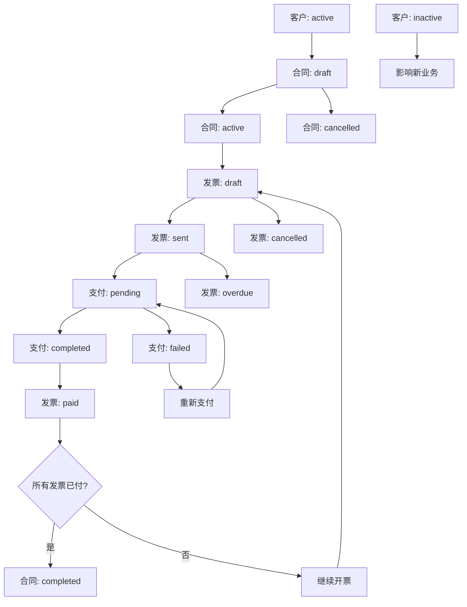

# 业务状态关系说明文档

## 概述

本文档详细说明了合同管理系统中客户状态、合同状态、发票状态、支付状态之间的逻辑业务关系和状态变化流程。

## 状态定义

### 1. 客户状态 (Customer Status)
| 状态 | 中文名称 | 说明 |
|------|----------|------|
| `active` | 活跃 | 可以正常进行业务往来 |
| `inactive` | 停用 | 暂停业务往来，不能创建新合同 |

### 2. 合同状态 (Contract Status)
| 状态 | 中文名称 | 说明 |
|------|----------|------|
| `draft` | 草稿 | 合同起草阶段，尚未生效 |
| `active` | 执行中 | 合同已生效，正在执行 |
| `completed` | 已完成 | 合同履行完毕 |
| `cancelled` | 已取消 | 合同终止或作废 |

### 3. 发票状态 (Invoice Status)
| 状态 | 中文名称 | 说明 |
|------|----------|------|
| `draft` | 草稿 | 发票起草阶段（仅用于历史数据兼容） |
| `sent` | 已发送 | 发票已开具并发送给客户，等待付款 |
| `paid` | 已付款 | 发票已收到全额付款 |
| `overdue` | 逾期 | 发票超过付款期限未付 |
| `cancelled` | 已取消 | 发票作废 |

### 4. 支付状态 (Payment Status)
| 状态 | 中文名称 | 说明 |
|------|----------|------|
| `pending` | 待处理 | 收款处理中 |
| `completed` | 已完成 | 收款成功到账 |
| `failed` | 失败 | 收款失败或被拒绝 |

## 业务关系流程

### 主要业务流程图



## 详细业务关系说明

### 1. 客户状态 → 合同状态

#### 业务规则
- **前置条件**：只有 `active` 状态的客户才能创建新合同
- **影响关系**：
  - 客户为 `active` 时：可以创建新合同，现有合同正常执行
  - 客户变为 `inactive` 时：不能创建新合同，但现有合同可继续执行

#### 状态变更场景
```
客户(active) → 可创建合同(draft/active)
客户(inactive) → 禁止创建新合同，现有合同不受影响
```

### 2. 合同状态 → 发票状态

#### 业务规则
- **开票条件**：只有 `active` 状态的合同才能开具发票
- **限制规则**：
  - `draft` 状态合同：不能开票
  - `completed` 状态合同：不能开新票
  - `cancelled` 状态合同：不能开新票，现有发票可能被取消

#### 状态变更场景
```
合同(draft) → 不能开票
合同(active) → 可开票(draft → sent)
合同(completed/cancelled) → 不能开新票
```

### 3. 发票状态 → 支付状态

#### 业务规则
- **支付触发**：发票状态为 `sent` 时可以发起支付
- **状态联动**：
  - 发票创建 → 自动设置为 `sent` 状态（已开发票）
  - 发票超期 → 发票变为 `overdue`
  - 支付成功 → 发票变为 `paid`

#### 状态变更场景
```
发票创建 → 发票(sent) → 支付(pending)
支付(completed) → 发票(paid)
支付(failed) → 发票保持(sent)或变为(overdue)
```

#### 重要说明
- **发票创建即开票**：系统中创建发票即表示已开具发票，因此状态直接设置为 `sent`
- **草稿状态废弃**：新创建的发票不再使用 `draft` 状态，该状态仅用于历史数据兼容

### 4. 支付状态 → 发票状态

#### 业务规则
- **反向影响**：支付状态直接影响发票状态
- **自动更新**：
  - 支付 `completed` → 发票自动变为 `paid`
  - 支付 `failed` → 发票保持原状态或标记逾期

#### 状态变更场景
```
支付(pending) → 支付(completed) → 发票(paid)
支付(pending) → 支付(failed) → 发票(sent/overdue)
```

### 5. 发票状态 → 合同状态

#### 业务规则
- **完成条件**：合同自动完成的条件
  - 合同下所有发票都变为 `paid` 状态
  - 发票总额达到或超过合同金额
- **自动变更**：满足条件时合同自动变为 `completed`

#### 状态变更场景
```
所有发票(paid) + 发票总额≥合同金额 → 合同(completed)
```

## 业务场景示例

### 场景1：正常业务流程
```
1. 客户(active) → 创建合同(draft)
2. 合同审核通过 → 合同(active)
3. 开具发票 → 发票(draft) → 发票(sent)
4. 客户付款 → 支付(pending) → 支付(completed)
5. 系统更新 → 发票(paid)
6. 所有发票付清 → 合同(completed)
```

### 场景2：支付失败处理
```
1. 发票(sent) → 支付(pending)
2. 支付失败 → 支付(failed)
3. 重新发起支付 → 支付(pending)
4. 支付成功 → 支付(completed) → 发票(paid)
```

### 场景3：逾期处理
```
1. 发票(sent) → 超过付款期限
2. 系统自动更新 → 发票(overdue)
3. 催收后付款 → 支付(completed) → 发票(paid)
```

### 场景4：异常终止
```
1. 合同执行中出现问题 → 合同(cancelled)
2. 相关未付发票 → 发票(cancelled)
3. 已发起的支付 → 根据情况处理
```

## 系统建议的状态管理规则

### 1. 状态变更权限
| 状态类型 | 变更权限 | 说明 |
|----------|----------|------|
| 客户状态 | 管理员 | 需要管理员权限才能停用/激活客户 |
| 合同状态 | 业务人员 + 系统自动 | 业务人员手动变更 + 系统条件触发 |
| 发票状态 | 财务人员 + 系统自动 | 财务人员操作 + 支付状态联动 |
| 支付状态 | 系统自动 + 财务确认 | 主要由支付系统自动更新 |

### 2. 自动化规则
- **支付完成** → 自动更新发票状态为已付款
- **所有发票付清** → 自动完成合同
- **超过付款期限** → 自动标记发票逾期
- **客户停用** → 自动限制新业务创建

### 3. 数据一致性保证
- **事务处理**：状态变更需要数据库事务保证
- **关联更新**：相关数据同步更新
- **变更日志**：记录所有状态变更历史
- **回滚机制**：支持异常情况下的状态回滚

## 状态变更通知机制

### 1. 系统通知
- 合同状态变更 → 通知相关业务人员
- 发票逾期 → 通知财务和业务人员
- 支付完成 → 通知财务人员
- 合同完成 → 通知所有相关人员

### 2. 客户通知
- 发票发送 → 邮件/短信通知客户
- 支付确认 → 发送付款确认
- 逾期提醒 → 发送催款通知

## 异常处理机制

### 1. 状态冲突处理
- **并发更新**：使用乐观锁防止状态冲突
- **非法变更**：验证状态变更的合法性
- **数据修复**：提供状态数据修复工具

### 2. 业务异常处理
- **支付失败**：支持重试机制
- **发票作废**：处理已发起的支付
- **合同取消**：处理相关发票和支付

## 总结

这套状态管理体系确保了：
1. **业务流程完整性**：覆盖从客户到收款的完整业务链条
2. **数据一致性**：通过状态联动保证数据准确性
3. **异常处理能力**：提供完善的异常情况处理机制
4. **自动化程度**：减少人工干预，提高处理效率
5. **可追溯性**：完整记录业务状态变更历史

通过这种设计，系统能够有效管理复杂的业务状态关系，确保业务流程的顺畅执行和数据的准确性。
